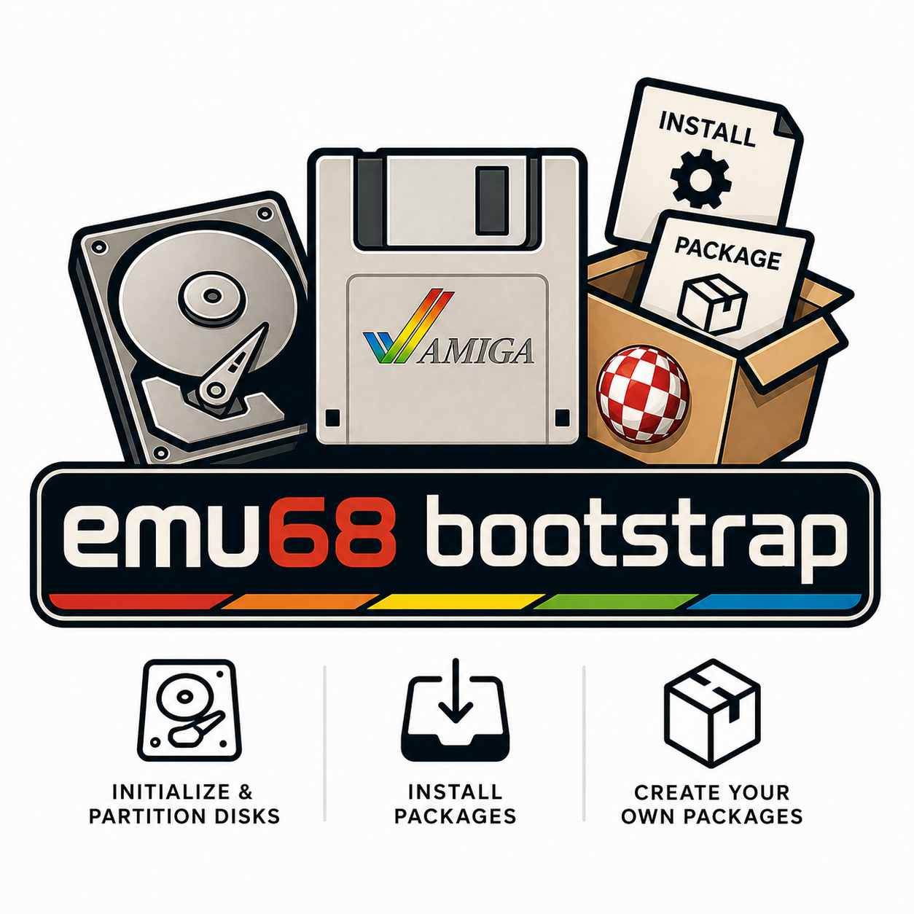

# Emu68-boostrap : Easy Amiga disk creation for emu68

[](logo)

- [Emu68-boostrap : Easy Amiga disk creation for emu68](#emu68-boostrap--easy-amiga-disk-creation-for-emu68)
  - [Overview](#overview)
  - [How to install](#how-to-install)
  - [Typical Usage](#typical-usage)
    - [1. Partition the Disk](#1-partition-the-disk)
    - [2. Deploy Amiga OS](#2-deploy-amiga-os)
  - [Dependencies](#dependencies)
    - [System Prerequisites (Hard Dependencies)](#system-prerequisites-hard-dependencies)
    - [Auto-managed Components (Soft Dependencies)](#auto-managed-components-soft-dependencies)
  - [Repository Structure](#repository-structure)
  - [Plans for futures releases](#plans-for-futures-releases)

## Overview

This toolchain provides a headless, Linux-native alternative to [Emu68-Imager](https://mja65.github.io/Emu68-Imager/). It is designed for users who need a powerful, scriptable way to prepare SD cards or disk images for Amiga systems (including Emu68/PiStorm) without a graphical interface.

Everything is customizable:

- **Partition scheme**: Define exactly how your disk is structured.
- **Emu68 config files**: Full control over your PiStorm/Emu68 setup.
- **Software payload**: Choose exactly what to install on your Amiga partitions.

Installation of Amiga software (including AmigaOS) is managed by a basic package mechanism consisting of a **package list** and **package description files**.

- The **list** identifies the archives to install (LHA, ZIP, ISO or ADF).
- The **description file** (`.desc`) specifies where to copy each file from the archive to any Amiga partition.

While package description files can be generated automatically, they usually allow for fine-tuned customization.

## How to install

Either clone this repository or download the latest release (if any). Every thing that is Amiga related is automaticaly downloaded. However, all the scripts have some dependencie : check the chapter [## Dependencies](#dependencies).

>Note: Emu68 Boostrap scripts as well as this repository **do not contains any commercial software**. Anything used by the scripts are downloaded from the internet on **publically available web sites** that I don't own nor control.

## Typical Usage

The following give you a quick overview of how to use it. For detailed instruction see the [full documentation](Documentation.md).

### 1. Partition the Disk

Initialize the RDB partitions and set up the filesystem based on `partitions.config`, then provide the required ickstart ROM for emu68

```bash
sudo ./setup_disk.sh -d /dev/sdc -k A1200.47.115.rom
```

### 2. Deploy Amiga OS

Install AmigaOS 3.2, emu68 tools and some system addons. In this example, we map the Amiga volume label "Workbench" to the physical device name "SDH0" defined in the RDB.
Off course you have to provide your own ADF files of Amiga OS 3.2 that must be copied in `AmigaOS_ADF` for base files and in `AmigaOSUpdate_ADF` for update ADF.

```bash
./package.sh -d /dev/sdc -m SDH0=Workbench -i OS32,emu68tools,picasso96,addons
```

>Note: as this script need to do some disk operations, it uses `sudo` and thus you may be prompted for a password.

## Dependencies

The toolchain distinguishes between system-level prerequisites and components that are automatically managed by the scripts.

### System Prerequisites (Hard Dependencies)

These must be installed on your Linux host before running any script. They are essential for archive manipulation, encoding conversion, and disk management.

| Tool | Purpose | Source / Project |
| :--- | :--- | :--- |
| **sudo** | root permissions are required for disk related operations | [sudo](https://www.sudo.ws/) |
| **wget** / **curl** | Downloading remote components and packages. | [Wget](https://www.gnu.org/software/wget/) / [Curl](https://curl.se/) |
| **lha** | Extracting Amiga `.lha` archives. | [GitHub](https://github.com/jca02266/lha) |
| **unadf** | Extracting files from Amiga Disk Files (`.adf`). | [unADF](http://lclevy.free.fr/adflib/) |
| **unzip** | Extracting firmware and tool archives. | [Info-ZIP](http://infozip.sourceforge.net/) |
| **gunzip** | Decompressing `.z` files from Amiga archives. | [GNU Gzip](https://www.gnu.org/software/gzip/) |
| **iconv** | Handling UTF-8 to ISO-8859-1 filename conversion. | [GNU libiconv](https://www.gnu.org/software/libiconv/) |
| **partprobe** | Updating the kernel partition table (RDB/MBR). | [GNU Parted](https://www.gnu.org/software/parted/) |
| **sed** | Path sanitization and configuration generation. | [GNU sed](https://www.gnu.org/software/sed/) |
| **convmv** | convert amiga encoded filename to utf8 | [convmv](https://directory.fsf.org/wiki/Convmv) |
| **isoinfo** | examines and extracts information from ISO 9660 filesystem images | [isoinfo](https://github.com/cmatsuoka/isoinfo) |
| **7zip** | extract files from an ISO 9660 filesystem images | [7zip](https://www.7-zip.org) |

### Auto-managed Components (Soft Dependencies)

To ensure compatibility and ease of use, the following components are **automatically downloaded and configured** by the scripts. You do not need to install these manually:

* **hst.imager**: The core engine used for RDB partitioning, scripting, and high-speed filesystem transfers. The script fetches the latest version if it's not present in the contribs folder.
  * [Project Link](https://github.com/henrikstengaard/hst.imager)
* **hst.amiga**: engine used to handle ".icons" files. The script fetches the latest version if it's not present in the contribs folder
  * [Project Link](https://github.com/henrikstengaard/hst.amiga)
* **Emu68 Firmware**: The latest release of the Emu68 firmware is automatically fetched from its official repository during the disk setup phase to populate the boot partition.
  * [Project Link](https://github.com/michalsc/Emu68)
* **Amiga Filesystems**: **pfs3aio** is bundled to be automatically installed into the RDB (Rigid Disk Block) for optimal partition performance.
  * [PFS3aio Reference](https://aminet.net/package/disk/misc/pfs3aio)

## Repository Structure

| Path                  | git ignore    | usage                                                 |
| :---                  | :---          | :---                                                  |
| .continue             | no            | configuration files for AI coding help                |  
| AmigaOS_ADF           | yes           | Amiga OS ADF files must be copied here                |
| AmigaOSUpdate_ADF     | yes           | Amiga OS Update ADF files must be copied here         |
| contribs              | no            | contains distribuable binaries used by the toolchain  |
| custom                | yes           | should contains any non free softwares                |
| Documentation.md      | no            | This is the detailled documentation                   |
| packages              | no            | contains packages list and description for install    |
| function.sh           | no            | kind of framework used by all the scripts             |
| generate_package.sh   | no            | see below : tries to generate package description     |
| LICENCE               | no            | read it :)                                            |
| logo.png              | no            | thank you chatGPT                                     |
| main.config           | no            | global parameters common to all scripts               |
| package.sh            | no            | see below : install packages on amiga partitions      |
| partitions.config     | no            | example of partition scheme used by setup_disk.sh     |
| README.md             | no            | you're reading it                                     |
| setup_disk.sh         | no            | see below : initialize disk for PiStorm               |

## Plans for futures releases

This are idea I would like to add in future versions with no particular order.

- Out of the box PiStorm configuration for Miami
- More glowicons replacements for applications
- Better icons position on the workbench partition
- Remove contribs from git and put then as assets on releases
- Add a hook mecanism that allows executing a script just before transfering files to Amiga partitions
- Split Addons package in smaller part for a more refined install
- Add package to set default Workbench Screen
- Add ECS / OCS games from my own selection (pimyretro.org)
- Add Native HDD game from ISO that do not contains CDDA tracks
- Create an Amiga Tools that "backup" all settings and icons positions into a installable package
- Test and document how to use ".icons" file to insert ToolsType
- Check existsing library version before copying to Workbench:Libs in order not to replace a version with an older one
